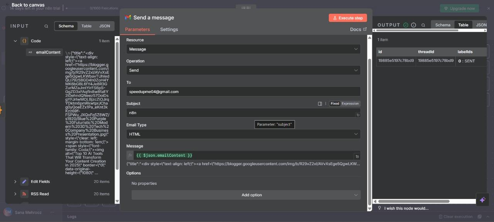

# n8n Email Automation Workflow

This is an n8n workflow created as part of a hands-on workshop to send HTML emails using dynamic content.

## 🔧 Features
- Uses `Send Email` node
- Dynamic HTML email content
- JSON-based data injection

## 🛠 Prerequisites
- [n8n](https://n8n.io/) installed locally or via Docker
- Gmail SMTP setup (or any other email provider)

## 📦 How to Use
1. Clone this repo:
   ```bash
   git clone https://github.com/your-username/n8n-email-automation-workshop
   cd n8n-email-automation-workshop
   ```
2. Open `n8n` and import `workflow.json`
3. Update your credentials (Gmail, SendGrid, etc.)
4. Trigger the workflow manually or on schedule

## 🖼 Screenshot


## ✍️ Author
Sumith Sourav
